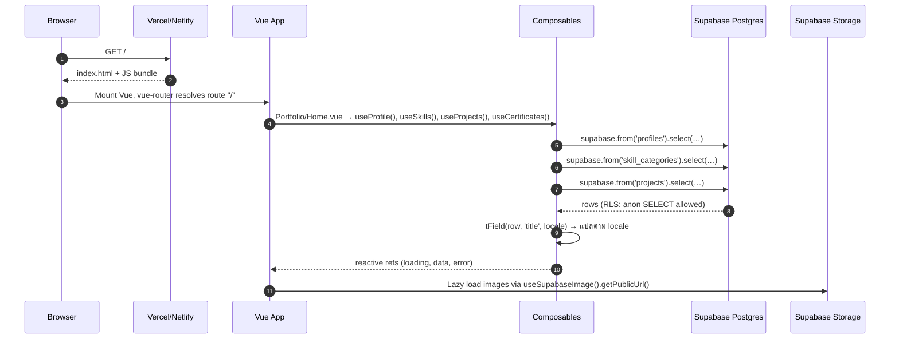
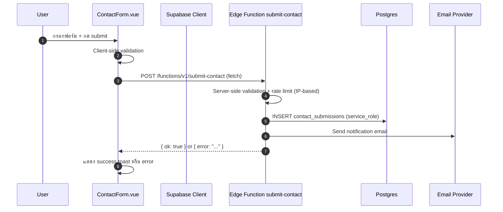

# Architecture

เอกสารนี้อธิบายสถาปัตยกรรมของ **DevFolio** ฉบับ Vue + Supabase — ครอบคลุม bird-eye view, data flow, routing strategy, bilingual system และ security model

---

## Table of Contents

- [1. High-Level Architecture](#1-high-level-architecture)
- [2. Data Flow](#2-data-flow)
- [3. Routing Strategy](#3-routing-strategy)
- [4. Bilingual System (End-to-End)](#4-bilingual-system-end-to-end)
- [5. Layer Responsibilities](#5-layer-responsibilities)
- [6. Security Model](#6-security-model)

---

## 1. High-Level Architecture

ไม่มี server-side rendering และไม่มี Laravel backend — ทุกอย่างเป็น **static SPA** ที่ browser รันและดึงข้อมูลจาก Supabase โดยตรง

```mermaid
flowchart TB
    subgraph Client["Browser (Vue SPA)"]
        V[Vue 3 + vue-router]
        C[Composables<br/>useProfile, useProjects, …]
        I[vue-i18n]
        A[GSAP + Three.js]
    end

    subgraph CDN["CDN / Static Host"]
        HOST[Vercel / Netlify]
    end

    subgraph Supabase["Supabase Cloud"]
        PG[(PostgreSQL<br/>RLS enabled)]
        ST[(Storage<br/>devfolio-public)]
        EF[Edge Functions<br/>submit-contact]
    end

    subgraph External["External"]
        MAIL[Email provider<br/>Resend / SendGrid]
    end

    Browser -->|HTTPS| HOST
    HOST -->|Static files| Browser
    C -->|supabase.from().select()| PG
    C -->|publicUrl()| ST
    C -->|POST /submit-contact| EF
    EF -->|insert| PG
    EF -->|send email| MAIL
```

### สรุปส่วนประกอบ

| Layer | Technology | บทบาท |
|-------|-----------|------|
| SPA | Vue 3 + TypeScript | Render UI, routing, state |
| Router | vue-router (History mode) | Client-side navigation |
| Data | Supabase JS client | อ่าน DB ด้วย anon key + RLS |
| i18n | vue-i18n + `tField()` helper | แสดงข้อความตาม locale |
| Animation | GSAP + Three.js | scroll animation, starfield |
| Admin | Supabase Dashboard | CRUD content (แทน Filament) |
| Database | Supabase Postgres | Single source of truth |
| Storage | Supabase Storage | รูปภาพ, resume PDF |
| Edge Function | Supabase Edge Functions | Contact form (email + rate limit) |

---

## 2. Data Flow

### 2.1 Page Load (Portfolio Home)



### 2.2 Contact Form Submission



> หาก Edge Function ยังไม่ได้ deploy — `useContact.ts` จะ insert โดยตรงผ่าน `supabase.from('contact_submissions').insert()` แต่ไม่มีการส่งอีเมล ดู [api-internal.md § Contact](api-internal.md#contact-form)

### 2.3 Language Toggle

ต่างจาก Inertia (ที่ต้อง reload page) — ตอนนี้เป็น **client-side reactive**:

```mermaid
flowchart LR
    A[User คลิก TH/EN] --> B[switchLocale()]
    B --> C[เขียน cookie locale=th/en]
    B --> D[locale ref เปลี่ยนค่า]
    D --> E[Composables watch locale → refetch]
    E --> F[tField() แปลข้อมูลใหม่]
    F --> G[Vue re-render เนื้อหา]
```

---

## 3. Routing Strategy

### 3.1 Vue Router Routes

```ts
// src/router.ts
const routes = [
    { path: '/',                   name: 'portfolio.home',    component: Portfolio/Home },
    { path: '/projects/:slug',     name: 'portfolio.project', component: Portfolio/ProjectDetail },
    { path: '/freelance',          name: 'freelance.home',    component: Freelance/Home },
    { path: '/contact/thank-you',  name: 'contact.thankYou',  component: Contact/ThankYou },
];
```

### 3.2 เปรียบเทียบกับ Inertia เดิม

| เดิม (Laravel subdomain) | ใหม่ (vue-router path) |
|--------------------------|------------------------|
| `devfolio.domain.com/` | `domain.com/` |
| `hire.domain.com/` | `domain.com/freelance` |
| `devfolio.domain.com/projects/:slug` | `domain.com/projects/:slug` |
| Subdomain routing ใน Laravel | Path-based routing ใน vue-router |

### 3.3 Site Mode

`useSiteMode.ts` อ่าน route name แทนที่จะรับจาก Inertia shared props:

```ts
// src/Composables/useSiteMode.ts
import { computed } from 'vue';
import { useRoute } from 'vue-router';

export function useSiteMode() {
    const route = useRoute();
    const mode = computed<'portfolio' | 'freelance'>(() =>
        String(route.name ?? '').startsWith('freelance') ? 'freelance' : 'portfolio'
    );
    return { mode, isPortfolio: computed(() => mode.value === 'portfolio'), isFreelance: computed(() => mode.value === 'freelance') };
}
```

### 3.4 Static Site Hosting — SPA Fallback

เพราะใช้ History mode ต้องตั้ง fallback ให้ทุก route serve `index.html`:

**Vercel** (`vercel.json`):
```json
{
  "rewrites": [{ "source": "/(.*)", "destination": "/index.html" }]
}
```

**Netlify** (`public/_redirects`):
```
/*  /index.html  200
```

---

## 4. Bilingual System (End-to-End)

### 4.1 ปรัชญา

- **Database**: ทุก content field มี 2 column — `_th` และ `_en` (เช่น `title_th`, `title_en`)
- **Client**: `tField()` helper เลือก column ที่ถูกต้องตาม `locale` ref
- **UI strings**: ใช้ vue-i18n (`$t()`) สำหรับ label, button text, error message

### 4.2 `tField()` Helper

```ts
// src/lib/translate.ts
export function tField(row, base, locale) {
    const localized = row[`${base}_${locale}`];
    if (typeof localized === 'string' && localized !== '') return localized;

    // Fallback ไป EN ถ้า locale ปัจจุบันว่าง
    const fallback = row[`${base}_en`];
    if (typeof fallback === 'string' && fallback !== '') return fallback;

    return null;
}
```

### 4.3 Locale State

```ts
// src/Composables/useLocale.ts — module-level singleton
const locale = ref<Locale>(initialLocale());  // อ่านจาก cookie ก่อน

export function useLocale() {
    function switchLocale(newLocale: Locale) {
        // เขียน cookie ให้ persist ข้าม tab/reload
        document.cookie = `locale=${newLocale};path=/;expires=…;SameSite=Lax`;
        locale.value = newLocale;
        // composables ทุกตัวที่ watch(locale) จะ refetch อัตโนมัติ
    }
    return { locale, switchLocale };
}
```

### 4.4 Composable Refetch Pattern

```ts
// ตัวอย่างใน useProfile.ts
watch(locale, load);  // เมื่อ locale เปลี่ยน → โหลดข้อมูลใหม่
```

### 4.5 Two Sources of Text

| ประเภท | แหล่งที่มา | ตัวอย่าง |
|-------|-----------|---------|
| Content (dynamic) | DB column `_th` / `_en` → `tField()` | `profile.headline`, `project.title` |
| UI strings (static) | vue-i18n (`$t()`) | nav links, button labels, error messages |

---

## 5. Layer Responsibilities

| Layer | Responsibility | ห้ามทำ |
|-------|---------------|--------|
| **Vue Components** | แสดงผล, animation, form input | ไม่เรียก supabase โดยตรง |
| **Composables** | Fetch data, transform, reactive state | ไม่มี UI logic |
| **`lib/translate.ts`** | `tField()` bilingual resolution | ไม่มี side effect |
| **`lib/mappers.ts`** | Raw DB row → typed view model | ไม่ fetch data |
| **`lib/supabase.ts`** | Supabase client singleton | ไม่ expose service_role key |
| **vue-router** | Client-side navigation | ไม่ทำ data fetching |
| **Edge Functions** | Server-side logic (email, rate limit) | ไม่ใช้ anon key สำหรับ sensitive op |

---

## 6. Security Model

### 6.1 Client ใช้ Anon Key เท่านั้น

```
Browser (Vue SPA) ──(anon key)──▶ Supabase (RLS enforced)
Edge Function      ──(service_role key — server side)──▶ Supabase (bypass RLS)
```

**ห้าม** ใส่ `service_role_key` ใน `.env` ที่ prefix ด้วย `VITE_` เพราะจะ bundle เข้า JS

### 6.2 RLS Policy Summary

| Table | anon SELECT | anon INSERT | หมายเหตุ |
|-------|------------|------------|---------|
| `profiles`, `projects`, `skills`, … | ✅ | ❌ | public read |
| `testimonials` | ✅ (is_published=true) | ❌ | filtered |
| `contact_submissions` | ❌ | ✅ | insert-only (ผ่าน Edge Function) |
| `users` | ❌ | ❌ | ไม่ expose |

ดูรายละเอียด SQL ใน [database.md § RLS](database.md#6-rls-policy-strategy)

### 6.3 Contact Form Security

Direct insert ผ่าน anon key เขียนได้ตาม RLS แต่ **ไม่มี rate limiting** และ **ไม่มี email notification** — ต้องใช้ Edge Function สำหรับ production:

```
Browser → Edge Function (validate + rate limit + insert + email) → DB + Email
```

ดู [api-internal.md § Contact](api-internal.md#contact-form) สำหรับ implementation guide
