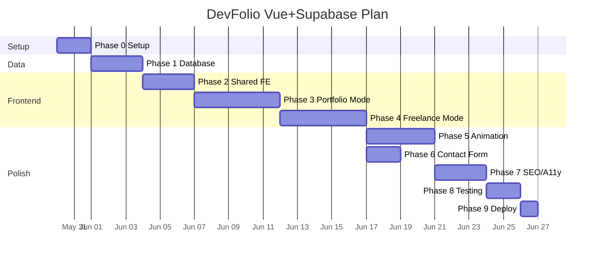
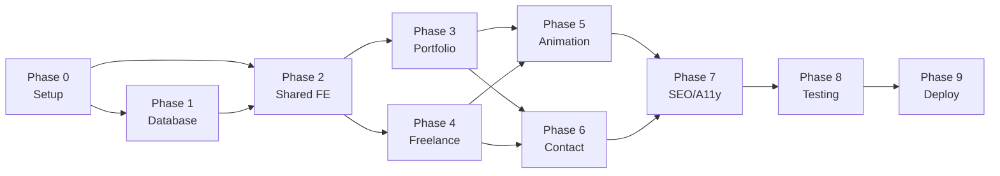

# Development Phases

Roadmap การพัฒนา DevFolio ฉบับ Vue + Supabase — แบ่งเป็น phase ที่ทำได้ทีละก้าว

---

## Table of Contents

- [ภาพรวม Timeline](#ภาพรวม-timeline)
- [Phase 0 — Setup & Foundation](#phase-0--setup--foundation)
- [Phase 1 — Database & Supabase](#phase-1--database--supabase)
- [Phase 2 — Shared Frontend Infrastructure](#phase-2--shared-frontend-infrastructure)
- [Phase 3 — Portfolio Mode](#phase-3--portfolio-mode)
- [Phase 4 — Freelance Mode](#phase-4--freelance-mode)
- [Phase 5 — Animation & Polish](#phase-5--animation--polish)
- [Phase 6 — Contact Form & Edge Function](#phase-6--contact-form--edge-function)
- [Phase 7 — SEO, Accessibility, Performance](#phase-7--seo-accessibility-performance)
- [Phase 8 — Testing & QA](#phase-8--testing--qa)
- [Phase 9 — Deployment & Launch](#phase-9--deployment--launch)
- [Post-Launch](#post-launch)

---

## ภาพรวม Timeline

**เวลารวมโดยประมาณ: 6–8 สัปดาห์** (part-time) / 3–4 สัปดาห์ (full-time)



---

## Phase 0 — Setup & Foundation

**เวลา:** 1–2 วัน | **Dependency:** ไม่มี

### Deliverables

1. Vue 3 + Vite + TypeScript scaffold ทำงาน
2. Supabase project สร้าง + credentials พร้อม
3. vue-router, Tailwind v4, `@supabase/supabase-js` ติดตั้งครบ
4. `.env.example` พร้อม, `README.md` ใช้ได้จริง

### Checklist

- [x] `npm create vite@latest . -- --template vue-ts`
- [x] ติดตั้ง `@supabase/supabase-js`, `vue-router@4`
- [x] ติดตั้ง Tailwind v4: `@tailwindcss/vite`
- [x] ติดตั้ง `vue-i18n`, `gsap`, `three`
- [x] สร้าง Supabase project, copy `VITE_SUPABASE_URL` + `VITE_SUPABASE_ANON_KEY`
- [x] `src/lib/supabase.ts` — client singleton
- [x] `src/router.ts` — routes ครบ (portfolio, freelance, project-detail, thank-you)
- [x] `src/main.ts` — mount app + router
- [x] `vercel.json` หรือ `public/_redirects` สำหรับ SPA fallback
- [x] Test: `npm run dev` เปิดได้, console ไม่มี Supabase error

### Acceptance

```bash
npm run dev
# เปิด http://localhost:5173 เห็น App.vue (หน้าว่าง) ไม่มี error
```

---

## Phase 1 — Database & Supabase

**เวลา:** 2–3 วัน | **Dependency:** Phase 0

### Deliverables

1. Schema ครบทุกตาราง (รัน `supabase/001_schema.sql`)
2. RLS policy ทุกตาราง (รัน `supabase/002_rls.sql`)
3. Storage bucket `devfolio-public` + policies (รัน `supabase/003_storage.sql`)
4. Seed ข้อมูลตัวอย่าง (profiles, skill_categories, social_links)

### Checklist

- [x] `supabase/001_schema.sql` — ครบ 11 tables + indexes
- [x] `supabase/002_rls.sql` — RLS ทุกตาราง
- [x] `supabase/003_storage.sql` — bucket + storage policies
- [x] Seed: `profiles` 1 row (singleton)
- [x] Seed: `skill_categories` 4 หมวด
- [x] Seed: `social_links` 2-4 รายการ
- [ ] Test: `supabase.from('profiles').select('*')` จาก browser ได้ data ไม่ error *(manual: ต้อง seed data + เปิด browser console)*

### Acceptance

```ts
// ทดสอบใน browser console
const { data } = await supabase.from('projects').select('id, title_en');
console.log(data); // ควรได้ array (อาจว่างถ้ายังไม่ seed)
```

---

## Phase 2 — Shared Frontend Infrastructure

**เวลา:** 2–3 วัน | **Dependency:** Phase 1

### Deliverables

1. Tailwind v4 theme (space palette) พร้อม
2. `useLocale` + `tField()` + vue-i18n (TH/EN)
3. Shared layouts: `PortfolioLayout`, `FreelanceLayout`
4. Composables ทุกตัว (data fetching + utility)
5. Shared components: `Navbar`, `Footer`, `LocaleToggle`, `LazyImage`, `Button`, `Icon`
6. `useSiteMode` (จาก route name)

### Checklist

- [x] `src/css/app.css` — Tailwind v4 + custom theme + font vars
- [x] Font loading (Inter + Noto Sans Thai + Space Grotesk)
- [x] `src/lib/translate.ts` — `tField()` helper
- [x] `src/lib/mappers.ts` — raw row → typed models
- [x] `src/Composables/useLocale.ts` — singleton locale ref + cookie
- [x] `src/Composables/useSiteMode.ts` — จาก route name
- [x] `src/Composables/useSupabaseImage.ts`
- [x] `src/Composables/useScrollAnim.ts` + `useGsapAnim.ts`
- [x] `src/Composables/useReducedMotion.ts`
- [x] `src/Composables/useSeo.ts`
- [x] Data composables: `useProfile`, `useSharedProfile`, `useSkills`, `useProjects`, `useProject`, `useCertificates`, `useFreelanceProjects`, `usePackages`, `useTestimonials`, `useProcessSteps`
- [x] `src/i18n/th.ts` + `en.ts` + `index.ts`
- [x] `PortfolioLayout.vue` + `FreelanceLayout.vue`
- [x] `Navbar.vue` (variant prop)
- [x] `Footer.vue`
- [x] `LocaleToggle.vue`
- [x] `LazyImage.vue`, `Button.vue`, `Icon.vue`, `SectionHeading.vue`
- [ ] Test: เปิด `/` เห็น layout เปล่า + toggle ภาษา cookie persist *(manual: เปิด browser)*

### Acceptance

- เปิด `localhost:5173` เห็น `PortfolioLayout` (navbar + footer)
- สลับ TH ↔ EN แล้ว static label เปลี่ยน
- เปิด `localhost:5173/freelance` เห็น `FreelanceLayout`

---

## Phase 3 — Portfolio Mode

**เวลา:** 4–5 วัน | **Dependency:** Phase 1 (data) + Phase 2 (shared)

### Deliverables

1. `Pages/Portfolio/Home.vue` — ดึงข้อมูลและแสดงครบทุก section
2. `Pages/Portfolio/ProjectDetail.vue` — gallery + testimonials
3. Components ครบ: Hero, About, SkillGrid, ProjectGrid, CertificateGrid, ContactSection
4. Project filter (tech/type) ผ่าน reactive composable
5. Responsive mobile-first ทุก section

### Checklist

- [x] `Pages/Portfolio/Home.vue` — useProfile, useSkills, useProjects, useCertificates
- [x] `Components/Portfolio/Hero.vue`
- [x] `Components/Portfolio/About.vue`
- [x] `Components/Portfolio/SkillGrid.vue` + `SkillCategoryBlock.vue` + `SkillBar.vue`
- [x] `Components/Portfolio/ProjectGrid.vue` + `ProjectCard.vue` + `ProjectFilter.vue`
- [x] `Components/Portfolio/CertificateGrid.vue` + `CertificateCard.vue`
- [x] `Components/Portfolio/ContactSection.vue`
- [x] `Pages/Portfolio/ProjectDetail.vue` — useProject + gallery
- [x] Filter: reactive `filterTech` / `filterType` ใน `useProjects`
- [x] Responsive: sm, md, lg, xl breakpoints

### Acceptance

- เปิด `/` เห็นข้อมูลจริงจาก Supabase
- คลิก tech filter → project list อัพเดต ไม่ reload page
- `/projects/:slug` แสดง gallery + testimonials

---

## Phase 4 — Freelance Mode

**เวลา:** 4–5 วัน | **Dependency:** Phase 3 (reuse components)

### Deliverables

1. `Pages/Freelance/Home.vue` — ดึงข้อมูลครบ
2. Components: Hero, About, PackageGrid, SelectedProjects, TestimonialCarousel, ProcessTimeline, ContactSection
3. Pricing display ด้วย `useFormatPrice` (Intl.NumberFormat)
4. PackageCard CTA scroll ไปที่ contact form + pre-fill `package_slug`

### Checklist

- [x] `Pages/Freelance/Home.vue` — useProfile (freelance), usePackages, useFreelanceProjects, useTestimonials, useProcessSteps
- [x] `Components/Freelance/Hero.vue`
- [x] `Components/Freelance/About.vue` (stats)
- [x] `Components/Freelance/PackageGrid.vue` + `PackageCard.vue` (is_recommended highlight)
- [x] `Components/Freelance/SelectedProjects.vue` (reuse ProjectCard)
- [x] `Components/Freelance/TestimonialCarousel.vue` (scroll-snap)
- [x] `Components/Freelance/ProcessTimeline.vue`
- [x] `Components/Freelance/ContactSection.vue`
- [x] `useFormatPrice.ts` — `Intl.NumberFormat('th-TH', { style: 'currency', currency: 'THB' })`

### Acceptance

- `/freelance` แสดงครบทุก section
- Package recommended มี visual highlight
- กดปุ่มเลือก package → scroll + prefill package_slug ในฟอร์ม
- Carousel swipe ได้บนมือถือ

---

## Phase 5 — Animation & Polish

**เวลา:** 3–4 วัน | **Dependency:** Phase 3 + 4

### Deliverables

1. Three.js space background (StarField) ใน layout
2. GSAP ScrollTrigger ทุก section
3. Micro-interaction (hover, card lift, button glow)
4. `prefers-reduced-motion` respected

### Checklist

- [x] `Components/Three/StarField.vue` + `SpaceBackground.vue`
- [x] Hero entrance animation (fade up)
- [x] Section enter animation via `useScrollAnim`
- [x] Card hover: lift + glow (ProjectCard, PackageCard)
- [x] Navbar scroll behavior (solid bg เมื่อ scroll)
- [x] SkillBar: animate width 0 → level%
- [x] `useReducedMotion` — disable animation ทั้งหมด
- [x] Three.js: pause render เมื่อ `document.hidden`
- [ ] Audit: Lighthouse Performance ≥ 90 mobile *(manual: รันบน production build / browser)*

### Acceptance

- Scroll ลงมาทุก section มี animation smooth
- OS "Reduce motion" → animation disable
- Three.js CPU < 15% on idle

---

## Phase 6 — Contact Form & Edge Function

**เวลา:** 2 วัน | **Dependency:** Phase 3 + 4

### Deliverables

1. `useContact.ts` — submit ผ่าน Supabase insert (direct)
2. Validation บน client-side
3. Toast success / error
4. ThankYou page
5. (Optional) Supabase Edge Function สำหรับ email notification + rate limit

### Checklist

- [x] `Components/Shared/ContactForm.vue` + `Toast.vue`
- [x] `useContact.ts` — direct supabase.insert
- [x] `useFlash.ts` — toast state
- [x] Client validation (name, email, message required)
- [x] `Pages/Contact/ThankYou.vue`
- [x] Edge Function `submit-contact` (email + rate limit) — `supabase/functions/submit-contact/index.ts`; เปิดใช้ด้วย `VITE_USE_CONTACT_FN=true`

### Acceptance

- Submit form สำเร็จ → แสดง success toast / redirect ThankYou
- กรอกข้อมูลไม่ครบ → แสดง error ใต้ field
- Row ปรากฏใน `contact_submissions` table

---

## Phase 7 — SEO, Accessibility, Performance

**เวลา:** 2–3 วัน | **Dependency:** Phase 3 + 4 + 5

### Deliverables

1. Meta tags ครบ (title, description, og:*, hreflang)
2. JSON-LD (Person schema)
3. Accessibility: keyboard nav, ARIA, alt text, contrast
4. Lighthouse ≥ 90 ทุกหมวด

### Checklist

- [x] `useSeo.ts` — document.title + meta tags (description, og:*)
- [x] `hreflang` tags ใน `index.html`
- [x] JSON-LD Person schema ใน layout
- [x] ทุก `` มี `alt` (bilingual)
- [x] Icon-only button มี `aria-label`
- [x] `:focus-visible` ring บน interactive elements
- [x] `skip-to-content` link
- [ ] axe DevTools — ไม่มี critical issue *(ต้องตรวจบน browser)*
- [ ] Lighthouse mobile ≥ 90 *(ต้องรันบน production build)*
- [x] `sitemap.xml` — `public/sitemap.xml` + `robots.txt`; regenerate ด้วย `npm run sitemap` (ดึง project slugs จาก Supabase)

---

## Phase 8 — Testing & QA

**เวลา:** 1–2 วัน | **Dependency:** Phase 1-7

### Checklist

- [x] `vue-tsc --noEmit` ผ่าน (type check)
- [x] ESLint ผ่าน
- [x] Vitest unit test: `tField()`, `useFormatPrice`, mappers — 17 tests ผ่าน (`npm test`)
- [ ] Cross-browser: Chrome, Safari, Firefox
- [ ] Mobile: iOS Safari, Android Chrome
- [ ] Manual: ทุก route ทำงานได้หลัง hard refresh (SPA fallback)

---

## Phase 9 — Deployment & Launch

**เวลา:** 1 วัน | **Dependency:** Phase 8

### Checklist

- [ ] ซื้อ domain + ตั้ง DNS ไปยัง Vercel/Netlify
- [ ] ตั้ง Environment Variables บน hosting
- [ ] Supabase: เพิ่ม custom domain ใน Allowed URLs
- [ ] RLS verify ใน production
- [ ] Post-deploy checklist ผ่าน (ดู [deployment.md § 7](deployment.md#7-post-deploy-checklist))
- [ ] UptimeRobot monitor
- [ ] Google Search Console verify

---

## Post-Launch

### 1. Content Maintenance (ongoing)

- เพิ่ม project ใหม่ผ่าน Supabase Studio
- เก็บ testimonial จากลูกค้า
- Refresh bio ทุก 3 เดือน

### 2. Feature Backlog

- Edge Function สำหรับ contact email
- Vue admin panel (`/admin`) ด้วย Supabase Auth
- Project case study format
- Blog / Writing section
- Realtime visitor counter (Supabase Realtime)
- PWA (add-to-homescreen)
- Payment integration (PromptPay) ใน freelance mode

---

## Dependency Graph


